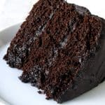

# Chocolate Cake

### Ingredients 

> For the cake \
225g/8oz plain flour \
350g/12½oz caster sugar \
85g/3oz cocoa powder \
1½ tsp baking powder \
1½ tsp bicarbonate of soda \
2 free-range eggs \
250ml/9fl oz milk \
125ml/4½fl oz vegetable oil \
2 tsp vanilla extract \
250ml/9fl oz boiling water \

> For the chocolate icing \
200g/7oz plain chocolate \
200ml/7fl oz double cream \

### INSTRUCTIONS -The Most Amazing Chocolate Cake

  
+ Preheat oven to 350 degrees Fahrenheit. Butter three 9-inch cake rounds. Dust with flour and tap out the excess.
+ Mix together flour, sugar, cocoa, baking soda, baking powder, and salt in a stand mixer using a low speed until combined.
+ Add eggs, buttermilk, warm water, oil, and vanilla. Beat on a medium speed until smooth. This should take just a couple of minutes.
+ Divide batter among the three pans. I found that it took just over 3 cups of the batter to divide it evenly.
+ Bake for 30-35 minutes in a 350 degree oven until a toothpick inserted into the center comes out clean.
+ Cool on wire racks for 15 minutes and then

